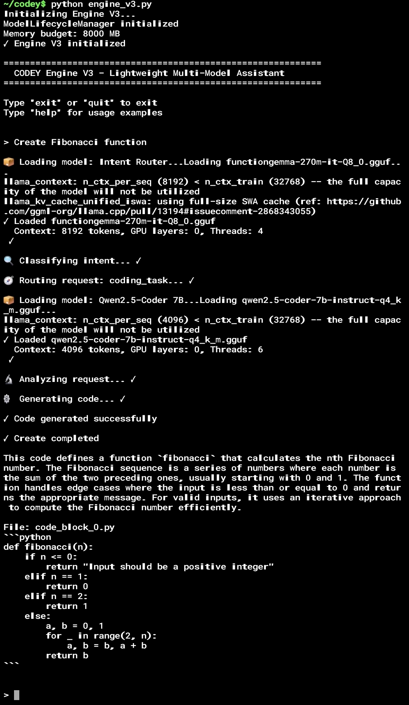

# Codey: The Local, CPU-Optimized AI Engineer

> **Version:** 3.4 (Phase 6.2: Input Handling, Model Caching & Extraction Fixes)
> **Architecture:** Local Multi-Model Orchestration with Chunked Execution
> **Focus:** Privacy, Zero-Cloud Dependency, CPU-Optimized Generation, Robust Code Extraction

Codey is a command-line AI software engineer designed to run **entirely on your local machine**. Unlike cloud-based assistants that rely on massive server farms, Codey runs on standard consumer hardware, including high-end mobile devices via Termux or UserLAnd. It maintains complete data privacy by ensuring no code or telemetry ever leaves your machine.

---

## Design Philosophy

Codey is built upon three core principles regarding local AI execution:

1.  **CPU-First by Design:** Codey is not a GPU-native application that merely tolerates CPUs. It is engineered specifically for the latency and bandwidth constraints of system RAM and CPU inference.
2.  **Stability Over Speed:** On local hardware, aggressive resource usage leads to system instability. Codey strictly budgets memory and prioritizes system responsiveness over raw token generation speed.
3.  **Iterative Correctness:** Codey favors iterative improvement over one-shot generation. Given the constraints of 7B parameter models, reliability is achieved by breaking complex tasks into smaller, verifiable steps rather than attempting complex architecture in a single pass.

---

## Capability Reality Check

### What Codey Does
*   **Runs Locally:** Operates without API keys, monthly fees, or data egress.
*   **Edits Code:** Reads, analyzes, and modifies files directly in the workspace.
*   **Plans Tasks:** Decomposes complex instructions (e.g., "create a react app") into executable steps.
*   **Manages Git:** Handles commits, status checks, and history.
*   **Optimizes Resources:** Enforces strict RAM budgeting to prevent operating system slowdowns.
*   **Builds Full-Stack Apps:** Generates complete web applications including backend (Flask/Django), frontend (HTML/CSS/JS), and database (SQLite) code.

### What Codey Is Not
*   **Instant:** On a CPU, inference takes time. Generating a complex function requires patience (often 30-60 seconds).
*   **A Supercomputer:** It utilizes 7B parameter models. It is competent at junior-to-mid-level tasks but will not architect microservices backends in a single prompt.
*   **Magic:** It relies on clear instructions, established context, and iterative refinement.

### Self-Awareness Boundaries
Codey operates within strict confidence and capability limits. It is designed to:
*   Explicitly report when a task exceeds its context window or logical capabilities.
*   Treat guessing and hallucination as critical failures, not features.
*   Request narrower scope or clarification rather than attempting low-confidence generation.

---

## System Architecture

Codey uses a Split-Brain Architecture to balance latency and intelligence:

1.  **The Reflex Layer (Router):**
    *   **Model:** FunctionGemma 270M
    *   **Role:** Instantly classifies requests as simple tool commands, questions, or coding tasks.
    *   **Latency:** Sub-second.

2.  **The Deep Layer (Coder):**
    *   **Model:** Qwen2.5-Coder 7B
    *   **Role:** Handles complex code generation, refactoring, and logic.
    *   **Latency:** Loaded on-demand (5-30 seconds).

3.  **Lifecycle Manager:**
    *   Actively manages RAM. If a memory limit is set (e.g., 6GB), Codey ensures idle models are unloaded before new ones are initialized to maintain system stability.

## Tool Registry & Safety

Codey employs a strict tool execution policy to prevent hallucinated actions:

*   **Registry:** Only explicitly defined tools (`git`, `shell`, `file`, `sqlite`) are executable.
*   **Safety Fallback:** If the Intent Router predicts a tool that doesn't exist (e.g., "tool: fix_code"), the system automatically intercepts this error and redirects the request to the general coding or Q&A path.
*   **Normalization:** Aliases are automatically mapped (e.g., "read" → "file", "terminal" → "shell") to handle natural language variations.

---

## Getting Started

### Prerequisites
*   **OS:** Linux / macOS / WSL2 / Android (Termux/UserLAnd)
*   **RAM:** 8GB minimum (16GB recommended)
*   **Storage:** ~10GB for models
*   **Python:** 3.10+

### Installation
```bash
# Clone the repository
git clone https://github.com/your-repo/codey.git
cd codey

# Install dependencies (incorporates hardware-specific builds)
pip install -r requirements.txt
```

### Getting Started Example: Mobile-First Demo

Codey has been validated to run end-to-end on high-end mobile devices (e.g., Samsung Galaxy S24 Ultra) via Termux or UserLAnd.

#### Termux Setup
To reproduce this demo on your Android device:

```bash
# 1. Install system dependencies
pkg update && pkg upgrade
pkg install python git clang make build-essential

# 2. Clone Codey
git clone https://github.com/your-repo/codey.git
cd codey

# 3. Install Python dependencies (compiles llama-cpp-python locally)
pip install -r requirements.txt

# 4. Launch Engine
python engine_v3.py
```

#### Example Command Run
**Device:** Samsung Galaxy S24 Ultra (Termux / UserLAnd)
**Prompt:** "Create Fibonacci function"

```text
~/codey$ python engine_v3.py
> Create Fibonacci function

📦 Loading model: Qwen2.5-Coder 7B...
✓ Loaded qwen2.5-coder-7b-instruct-q4_k_m.gguf
⚙️ Generating code...

def fibonacci(n):
    if n <= 0:
        return "Input should be a positive integer"
    elif n == 1:
        return 0
    elif n == 2:
        return 1
    else:
        a, b = 0, 1
        for _ in range(2, n):
            a, b = b, a + b
        return b
```

This demo validates that Codey's split-brain architecture (Router + Coder) functions correctly on mobile ARM64 CPUs, effectively managing memory to load the 7B model on-demand.



### Configuration
Codey auto-generates a `config.json` on first run. Key settings to tune:
*   `memory_budget_mb`: Set this to approximately 70% of available RAM.
*   `n_threads`: Set to the number of physical CPU cores.

---

## Usage

Start the engine:
```bash
python engine_v3.py
```

### Example Workflows

**1. Quick Tool Use (Fast)**
Codey executes these instantly using the Router.
```text
> git status
> create a directory named 'tests'
> read config.json
```

**2. Coding Tasks (Slower, Intelligent)**
Codey loads the 7B model. Expect a loading pause.
```text
> Create a Python script to scrape HackerNews headlines
> Refactor utils.py to use async/await
> Fix the bug in line 42 of main.py
```

**3. Multi-Step Planning**
Codey decomposes these into a sequence of actions.
```text
> Create a flask app structure and then write a hello world route
> 1. git pull 2. run tests 3. if pass, git push
```

**4. Full-Stack Development (Phase 6 Enhanced)**
Codey handles web application generation with frontend and backend components, automatically chunking the generation to avoid timeouts.
```text
> Create a full-stack todo app with Flask backend and SQLite database
> Build a web application with user authentication and a dashboard
```

**Example Output:**
```text
📋 Full-stack generation plan:
   Chunks: 8
   Estimated tokens: 2048
   Estimated time: 410s
   Database: Yes
--------------------------------------------------
⚙️  [1/8] Generating: Database models...  ✓ (45.2s)
⚙️  [2/8] Generating: Backend app...      ✓ (62.1s)
⚙️  [3/8] Generating: Database init...    ✓ (18.3s)
🖥️  [4/8] Creating directories...         ✓ (0.1s)
⚙️  [5/8] Generating: HTML template...    ✓ (55.8s)
⚙️  [6/8] Generating: CSS styles...       ✓ (35.2s)
⚙️  [7/8] Generating: JavaScript...       ✓ (48.6s)
📖  [8/8] Generating: README...            ✓ (2.1s)

✓ Task completed successfully!
  Total time: 267.4s
  Progress: 100%

📁 Generated Files:
  - models.py
  - app.py
  - init_db.py
  - templates/index.html
  - static/css/style.css
  - static/js/app.js
  - README.md
```

---

## Phase 6: CPU Optimization Features

Phase 6 introduces major optimizations for CPU-only hardware:

### Real-Time Streaming Output
Files are created **as tokens are generated**, not after completion:

```text
⚙️  Generating code...
   📝 Writing app.py... ✓ (1243 bytes)
   📝 Writing templates/index.html... ✓ (892 bytes)
   📝 Writing static/css/style.css... ✓ (567 bytes)
   → 156 tokens in 31.2s (5.0 tok/s)
```

Benefits:
- **Immediate file access**: Open files before generation completes
- **Reduced memory**: Content written to disk immediately
- **Better UX**: See progress in real-time

### Chunked Task Execution
Complex tasks are automatically decomposed into smaller, independently executable chunks:

| Chunk Type | Max Tokens | Purpose |
|------------|------------|---------|
| `backend_setup` | 256 | Flask/FastAPI app initialization |
| `backend_routes` | 384 | API routes and endpoints |
| `database_schema` | 192 | SQLite models and schema |
| `frontend_html` | 384 | HTML templates |
| `frontend_css` | 256 | CSS styles |
| `frontend_js` | 384 | JavaScript client logic |
| `readme` | 256 | Project documentation |

### Extended Timeouts for CPU
Default timeout increased from 120s to 300s (5 minutes) to accommodate CPU inference speeds.

### Progress Tracking
Real-time progress reporting during long-running operations:

```text
# Automatic progress display
🔍 Analyzing request...              ✓ (0.2s)
📦 Loading model: Qwen2.5-Coder...   ✓ (28.3s)
🧩 Generating chunk 1/5...           ✓ (42.1s)
   → Progress: 100/256 tokens (39%)
   → Speed: 4.8 tok/s
```

### Smart Model Caching
- **Intent-based preloading**: Models are loaded based on predicted task type
- **Memory-aware switching**: Automatic unloading of unused models
- **LRU eviction**: Least-recently-used models are unloaded first

### Improved mkdir Handling
Properly handles `mkdir -p` flag and multiple directories:
```bash
mkdir -p templates static/css static/js
# Creates all directories with parents as needed
```

### README Auto-Generation
Automatically generates project documentation:
- Project structure
- Installation instructions
- Usage examples
- API endpoint documentation (for web apps)

---

## Phase 6.1: Code Extraction & Quality Fixes

Phase 6.1 addresses code quality issues discovered during full-stack generation testing:

### Robust Code Extraction (`core/code_extractor.py`)
New CodeExtractor module handles all edge cases:
- Extracts code from ` ```language` code blocks
- Handles `# FILE: filename` markers
- Strips markdown wrappers and filename-only lines
- Validates content type matches expected file extension

### Explicit Chunk Prompts
Prompts now explicitly specify output format:
```text
Write CSS code for style.css.
OUTPUT ONLY CSS - no HTML, no JavaScript, no markdown
Start directly with CSS selectors like 'body {' or '* {'
```

### Content Type Validation
Before saving files, content is validated:
- `.css` files must contain CSS selectors, not HTML
- `.js` files must contain JavaScript, not HTML
- Wrong content triggers automatic retry with clarified prompt

### Retry on Wrong Content Type
If generated content doesn't match expected file type:
1. Detect mismatch (e.g., HTML in .css file)
2. Retry with ultra-explicit prompt
3. Up to 2 retries before accepting best result

### Template-Based Generation
These files no longer use LLM generation (faster, more reliable):
- **requirements.txt**: Template with Flask dependencies
- **README.md**: Uses ReadmeGenerator class

### Token Budget Enforcement
Max tokens now passed from chunk plan to coder:
- Each chunk respects its token budget (256-384)
- Prevents single chunks from consuming excessive tokens

### Batch Directory Permissions
Multiple directories created with single permission prompt:
```text
🔒 Permission required: Create 3 directories?
   - templates
   - static/css
   - static/js
   Proceed? [y/n]:
```

---

## Phase 6.2: Input Handling, Model Caching & Extraction Fixes

Phase 6.2 addresses critical UX issues discovered during extended testing:

### Multi-Line Input Handling (`engine_v3.py`)
Properly handles pasted multi-line prompts:
- Uses `select.select()` to detect buffered stdin
- Collects all pending lines within 50ms after initial input
- Prevents multi-line prompts from being split into separate tasks

**Before (broken):**
```text
> Create a Flask app with:
  Backend: REST API
  Frontend: HTML/JS

# Engine processes "Create a Flask app with:" as one task
# Then processes "Backend: REST API" as a SECOND task
# User sees duplicate/confused output
```

**After (fixed):**
```text
> Create a Flask app with:
  Backend: REST API
  Frontend: HTML/JS

# Engine collects all lines as single prompt
# Processes complete request correctly
```

### Smart Model Loading Display (`orchestrator.py`)
Model loading messages now only appear when actually loading:
- Checks `lifecycle.is_loaded()` before showing "Loading model..."
- Eliminates confusing "Loading" messages when model is already cached
- Applies to Router, Coder, and Algorithm models

**Before:**
```text
> write hello world
📦 Loading model: Qwen2.5-Coder 7B... ✓  # Shows every time!
> write goodbye world
📦 Loading model: Qwen2.5-Coder 7B... ✓  # Model was already loaded!
```

**After:**
```text
> write hello world
📦 Loading model: Qwen2.5-Coder 7B... ✓  # First load - shows message
> write goodbye world
⚙️ Generating code... ✓                   # Already loaded - no message
```

### Enhanced Code Extraction (`core/code_extractor.py`)
Improved garbage handling in LLM output:

**Garbage Prefix Patterns:**
- `leted`, `eted`, `pleted` (fragments of "completed")
- `// static/js/app.js` (filename comments)
- `# static/css/style.css` (path comments)
- `templates/`, `static/` (path prefixes)

**End-of-File Garbage Trimming:**
- Removes `File: something.py` at end
- Removes stray ` ``` ` code fences
- Removes `Code: filename.js` markers
- Removes step markers and horizontal rules

**Content Salvage:**
- CSS: Extracts valid CSS rules from HTML-mixed responses
- JS: Extracts valid JavaScript from corrupted output
- Auto-triggers when wrong content type detected

**Example:**
```text
Input (corrupted):
  leted

  // static/js/app.js
  document.addEventListener('DOMContentLoaded', () => {
      console.log('Hello');
  });

  File: code_block_0.py
  ```javascript

Output (cleaned):
  document.addEventListener('DOMContentLoaded', () => {
      console.log('Hello');
  });
```

---

## Performance Tuning

Running LLMs on CPU requires understanding the bottlenecks:

| Action | Time Cost | Explanation |
|---|---|---|
| **Routing** | < 1s | Small model, resident in memory. |
| **Model Loading** | 2-10s | Reading GBs from disk into RAM. Occurs when switching tasks. |
| **Generation** | 2-10 tok/s | Matrix multiplication on CPU is bandwidth-limited. |

**Recommendation:** Group similar tasks. Perform all coding tasks in sequence, then all git operations. This prevents "thrashing" (repeatedly loading/unloading models).

### Mobile Performance Notes (Validated on Samsung S24 Ultra)

Performance on mobile devices is constrained by thermal management and power limits. The following metrics were collected on a Samsung Galaxy S24 Ultra running Ubuntu inside UserLAnd.

```text
Test Device: Samsung Galaxy S24 Ultra
Environment: Ubuntu (UserLAnd)
Peak RAM Usage: 5229 MB
Model Load Time: 0.62 s (first coding task)
Generation Speed: 1.26 tok/s (Avg)
Observed Quirks:
 - CPU temperature ranged ~44-58°C during generation (normal thermal rise, no throttling observed)
 - Background apps may affect token generation speed
```

### Measurement Checklist (Internal)
For maintainers reproducing these metrics:
*   **RAM:** Use `benchmark_s24.py` (included in repo) or monitor `VmRSS` in `/proc/[pid]/status`.
*   **Load Time:** Calculated from the `model_load_ms` metric in `PerformanceTracker`.
*   **Speed:** Average `output_tokens / generation_ms` across 3 representative coding tasks.
*   **Thermals:** Subjective observation of device heat or CPU throttling flags.

---

## Tool Registry & Recommendations

Codey supports a variety of local tools to enhance your development workflow. These tools are executed directly on your machine, leveraging the OS capabilities.

| Category | Tool | Description | Example Usage |
| :--- | :--- | :--- | :--- |
| **File Management** | `file` | Read, write, list, and delete files in your workspace. | [`read config.json`](#example-workflows), `list files` |
| **Git** | `git` | Full version control integration. | [`git status`](#example-workflows), `git commit` |
| **Shell** | `shell` | Execute safe system commands. | `run tests.py`, `mkdir build`, `install numpy` |
| **Database** | `sqlite` | Local database operations. | `sqlite schema users.db`, `sqlite query users.db "SELECT * FROM users"` |
| **Testing** | `pytest` | Run test suites (via shell). | `run pytest tests/` |
| **Documentation** | `pydoc` | View Python documentation (via shell). | `run pydoc -b` |
| **Search** | `grep` | Search codebase (via shell). | `execute grep -r "TODO" .` |
| **System** | `top` | Monitor system resources (via shell). | `execute top -n 1` |

---

## Future Enhancements (Realistic Roadmap)

Codey evolves by focusing on achievable milestones that respect local hardware constraints.

### 🟢 Achieved
*   **Split-Brain Architecture:** Router (270M) + Coder (7B) separation.
*   **Lifecycle Management:** Strict RAM budgeting and LRU model unloading.
*   **Mobile Support:** Validated on Android via Termux/UserLAnd.
*   **Tool Safety:** Strict registry and regex fallback for robustness.
*   **Phase 6: CPU Optimization (v3.1-3.2):**
    *   **Real-Time Streaming File Output (v3.2):** Files are written as tokens are generated, not after completion.
    *   **Extended Timeouts (v3.2):** Default generation timeout increased from 120s to 300s for CPU inference.
    *   **Chunked Task Execution:** Breaks complex multi-step tasks into smaller, independently executable chunks.
    *   **Full-Stack App Decomposition:** Intelligently decomposes "create a full-stack app" requests into manageable chunks (backend, frontend, database, README).
    *   **Progress Tracking:** Real-time step-by-step reporting during long-running operations.
    *   **Smart Model Caching:** Intent-based preloading and memory-aware model switching.
    *   **Safe Tool Execution:** Tool aliases, retry logic, and automatic fallbacks.
    *   **Improved mkdir Handling (v3.2):** Properly handles `-p` flag and multiple directories.
    *   **README Auto-Generation:** Automatically generates project documentation after multi-step completions.
*   **Phase 6.1: Code Extraction & Quality (v3.3):**
    *   **Robust Code Extraction:** New CodeExtractor module handles markdown wrappers, FILE markers, and content validation.
    *   **Explicit Chunk Prompts:** File-type-specific prompts with clear output format instructions.
    *   **Content Type Validation:** Validates that .css contains CSS, .js contains JavaScript, etc.
    *   **Automatic Retry:** Wrong content type triggers retry with ultra-explicit clarification prompt.
    *   **Template-Based Generation:** requirements.txt and README.md use templates instead of LLM.
    *   **Token Budget Enforcement:** Max tokens passed from chunk plan to coder for strict budget control.
    *   **Batch Directory Permissions:** Multiple directories created with single permission prompt.
*   **Phase 6.2: Input Handling & Model Caching (v3.4):**
    *   **Multi-Line Input Handling:** Uses `select.select()` to collect pasted multi-line prompts as single request.
    *   **Smart Model Loading Display:** Only shows "Loading model..." when actually loading from disk, not when cached.
    *   **Enhanced Garbage Prefix Handling:** Cleans `leted`, `eted`, `pleted` fragments and filename comments.
    *   **End-of-File Garbage Trimming:** Removes stray code fences, `File:` markers, and step markers from end of output.
    *   **CSS/JS Content Salvage:** Extracts valid CSS/JS from HTML-mixed or corrupted LLM responses.

### 🟡 Near Term (v3.5 - v3.6)
*   **Unified Model Strategy:** Merge Algorithm/Coder roles into a single 7B model to eliminate reloading times.
*   **Smart Context:** Implement a sliding window or summary mechanism for long conversations.

### 🔴 Long Term (v4.0+)
*   **Multi-Modal Input:** Support for image inputs (e.g., "build this UI") — *requires larger VRAM/RAM*.
*   **Local Knowledge Base:** RAG (Retrieval-Augmented Generation) over your local codebase — *requires embedding model integration*.
*   **Plugin System:** Allow users to define custom tools via Python scripts.
*   **Speculative Decoding:** Use the small router to speed up the large model — *hardware permitting*.

---

## License

Codey is made available under a custom "Source Available" license.

**Summary at a glance:**
*   **You may:** Use, study, run, and modify the source code for personal or educational purposes.
*   **You may NOT:** Sell, redistribute for profit, or commercially exploit this software.

See [LICENSE.md] for full terms.
